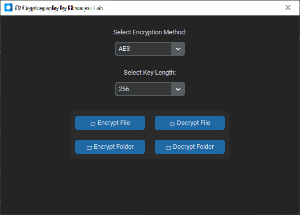

# 🔐 Cryptography by Hexagon Lab


A modern GUI-based Python application for encrypting and decrypting files and folders using 
strong cryptographic algorithms like AES and RSA. The interface is built with `customtkinter` for a sleek, dark-themed look.

---

## ✨ Features

✅ AES, RSA, and Fernet encryption  
✅ File and folder encryption/decryption  
✅ Automatically zips folders before encrypting  
✅ User-friendly GUI with themes  
✅ Drag-and-drop ready file selection  
✅ Copy/Paste support in text widgets  
✅ Dark/light theme via `ttkthemes`

---

## 📸 Screenshots

### 🖥 Main Interface  



---

## 📦 Installation

Install dependencies using:

```bash
pip install -r requirements.txt
```
## 🚀 Usage

1. **Run the script**:

   ```bash
   python main.py
   ```

2. **Select a method**: Choose AES, RSA, or Fernet

3. **Choose key length**: e.g., 256 bits for AES or 2048 bits for RSA

4. **Click an action**:

   * 📁 Encrypt File
   * 📂 Decrypt File
   * 🗂 Encrypt Folder
   * 📂 Decrypt Folder

---

## 🔒 Algorithms

| Algorithm | Type       | Key Sizes           | Notes                                   |
| --------- | ---------- | ------------------- | --------------------------------------- |
| AES       | Symmetric  | 128 / 192 / 256-bit | Fast, uses `.key` file                  |
| RSA       | Asymmetric | 512–4096-bit        | Best for small files; slower            |
| Fernet    | Symmetric  | 128-bit             | Currently shown for key generation only |

---

## 🗂 Output Examples

| Operation         | Output Files                                                     |
| ----------------- | ---------------------------------------------------------------- |
| AES Encrypt File  | `example.txt.enc`, `example.txt.key`                             |
| RSA Encrypt File  | `example.txt.enc`, `rsa_file_private.pem`, `rsa_file_public.pem` |
| Folder Encryption | `folder.zip.enc`, `folder.zip.key`                               |

---

## 🧠 Tips

* RSA encryption is best for small files only (<400 bytes at 4096 bits).
* Fernet is currently used only for key generation demo, not for file encryption.
* Store your `.key` or `.pem` files securely – they are required for decryption.
* ZIP archives are automatically created from folders before encryption.

---

## 📁 Project Structure

```
project/
├── main.py
├── assets/
│   ├── screenshot_main_ui.png
├── requirements.txt
└── README.md
```

---

## 👨‍💻 Author

Made with ❤️ using Python and `customtkinter`

#### **© 2025 **Hexagon Lab****

---

## 📜 License

Licensed under the MIT License.

